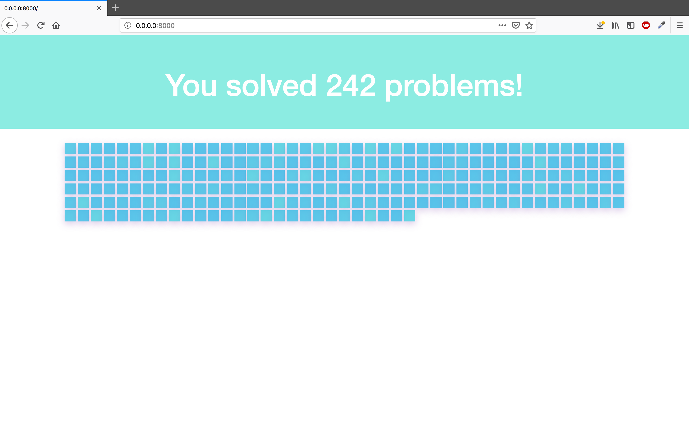

# GoGoSquares

I think many of us got inspired by that beautiful squares showing owr performance on GitHub and, as well, many of us have to complete diverse tasks or routines.

This small app is intended to preserve your progress in reaching some goal.

I tend to use it to keep track of problems solved during interview preparation stage, however I plan to allow anyone to create any amount of own boards where we can specufy any goal we pursue and any steps we took to reach it.

## The work has to be done:

* Finding home for the app - Any cheap server will fit

* Adding OAuth 2.0

* Adding db

* Adding CRUD functionalities

* Adding multiple boards features

* Allowing colors customization

* Allowing making boards private and public

* Making public user page

* Making main page

But I will not be working on all of this for now, just recorded the tasks for some time later.

## This is how it looks now:




## Running stuff

### Downloading Software

Please, make sure you have installed Python 2.7 and Flask. For easy installation of Flask use:
```
pip install flask  
```

### Getting Started

Please, run script via following code:
```
python gogosquares.py 
```

Then type this into your browser:
```
http://0.0.0.0:8000/
```
